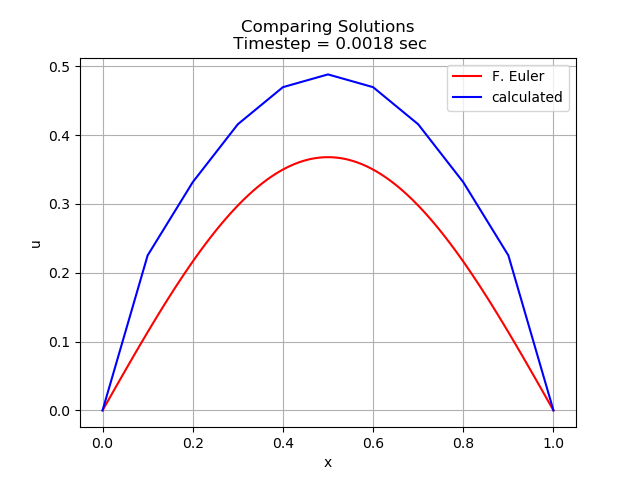
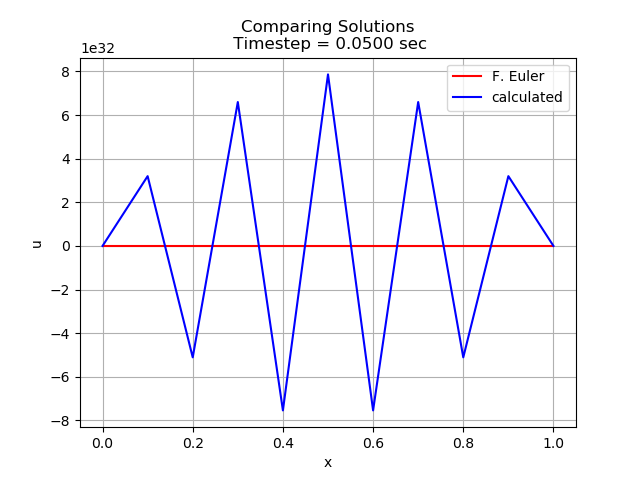
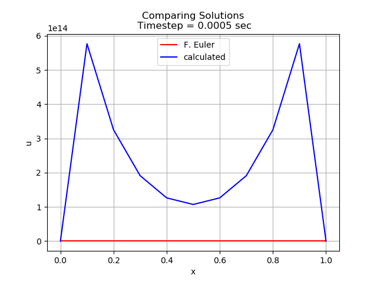
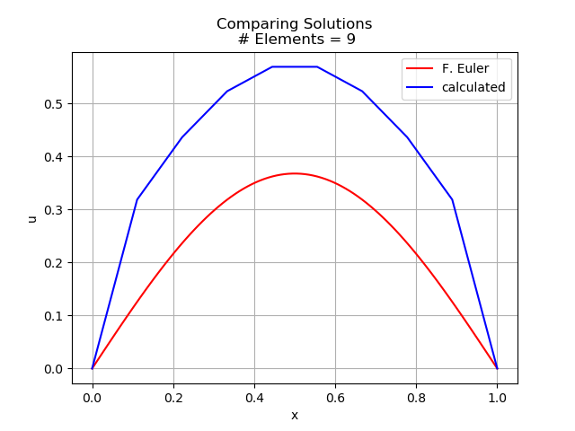
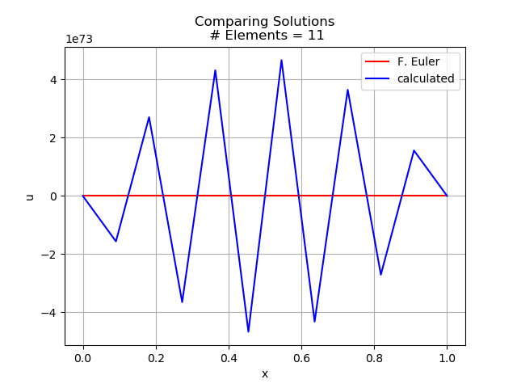
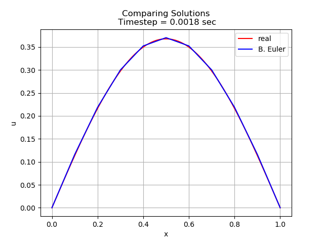
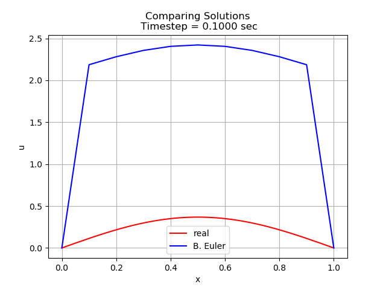

# COE 352 Project 2
## Solving the Heat Equation with FEM

* Solved the heat equation over a 1D domain using Galerkin FEM with 1st order Lagrangian Basis Functions. 
* Discretized the time domain using forward and backward Euler methods
* Implemented generalized RHS functions and boundary conditions

### Forward Euler
The Forward Euler time discretization was much less stable than Backward Euler. 
* A timestep of 1/560 was around the optimal value. There was an error of 0.1203 at x = 0.5. With a mesh size of 0.1, this gives a mesh ratio of 0.018.

* At dt < 1/557, the solution becomes highly unstable. Shown below is the critical timestep for a mesh ratio of 1/2.

* As dt increases past 1/600, the approximation gets worse and worse. This is a time step of 1/2000

* The solution is also very sensitive to the number of elements. At dt=1/562, which was optimal for 10 elements, any other mesh size results in divergence.

### Backward Euler
* Backward Euler was a much more stable method of time discretization. It was also much more accurate at the time step, as shown in the plot below.

* As the time step increases, the solution gets less accurate. With a timestep dt equal to the mesh size dx, the solution is very innacurate. Again looking at the mesh ratio G = dt/dx = 10, we can see that a mesh ratio G > 1/2 ensures instability of our time discretization.

